#  Lab 1c: Connect two Azure Virtual Networks using global virtual network peering

## Lab Overview

In this lab, you will learn how to configure connectivity between two Azure Virtual Networks (VNets) by using VNet Peering. Specifically, the lab will focus on connecting CoreServicesVnet and ManufacturingVnet to allow seamless traffic flow between them. This capability enables communication between resources in different VNets without requiring a VPN gateway or public IP addresses, and it also ensures high availability and scalability for network resources.

## Lab Objective

In this lab, you will complete the following tasks:

+ Task 1: Create a Virtual Machine to test the configuration
+ Task 2: Connect to the Test VMs using RDP
+ Task 3: Test the connection between the VMs
+ Task 4: Create VNet peerings between CoreServicesVnet and ManufacturingVnet
+ Task 5: Test the connection between the VMs
+ Task 6: Clean up resources

## Estimated time: 20 minutes

## Architecture diagram

   ‎

### Task 1: Create a Virtual Machine to test the configuration

In this task, you will create a test VM on the Manufacturing VNet to test if you can access resources inside another Azure virtual network from your ManufacturingVnet.

#### Create ManufacturingVM

1. On the Azure portal select the **Cloud shell** (**[>_]**)  button at the top of the page to the right of the search box. This opens a cloud shell pane at the bottom of the portal.

   

1. The first time you open the Cloud Shell, you may be prompted to choose the type of shell you want to use (*Bash* or *PowerShell*). If so, select **PowerShell**.

    
   
1. On **Getting started** window choose **Mount storage account (1)** then under **Storage account subscription (2)** select your available subscription from the dropdown and click on **Apply (3)**.
   
     
   
1. Within the Mount storage account pane, select **I want to create a storage account (1)** and click **Next (2)**.

     

1. On the **Create storage account** page, provide the following details:

   - Subscription: Leave the default one **(1)**
   - Please make sure you have selected your resource group **ContosoResourceGroup-<inject key="DeploymentID" enableCopy="false"/> (2)**

   - Select the Region **<inject key="Region" enableCopy="false"/> (3)**
   
   - Enter **blob<inject key="DeploymentID" enableCopy="false"/>** for the **Storage account name (4)**

   - Enter **blobfileshare<inject key="DeploymentID" enableCopy="false"/> (5)** for the  **File share**
   
   - Then click on **Create (6)**

     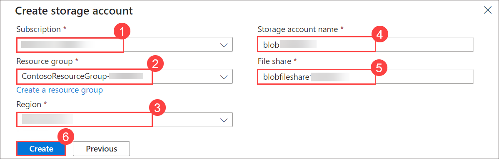

1. On the toolbar of the Cloud Shell pane, select the Select **Manage files (1)** icon, in the drop-down menu, select **Upload (2)**.

     
   
1. Navigate to `C:\AllFiles\AZ-700-Designing-and-Implementing-Microsoft-Azure-Networking-Solutions-prod\Allfiles\Exercises\M01` **(1)**, upload the following files **ManufacturingVMazuredeploy.json** and **ManufacturingVMazuredeploy.parameters.json** files **(2)** and then **Open (3)**.

     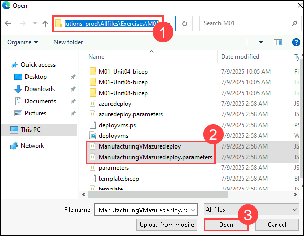

1. Deploy the following ARM templates to create the VMs needed for this exercise:

   ```powershell
   $RGName = "ContosoResourceGroup-<inject key="DeploymentID" enableCopy="false"/>"
   
   New-AzResourceGroupDeployment -ResourceGroupName $RGName -TemplateFile ManufacturingVMazuredeploy.json -TemplateParameterFile ManufacturingVMazuredeploy.parameters.json
   ```

1. You will be prompted to provide an Admin password. Provide Admin password Password: **Pa$$w0rd1234**.   

    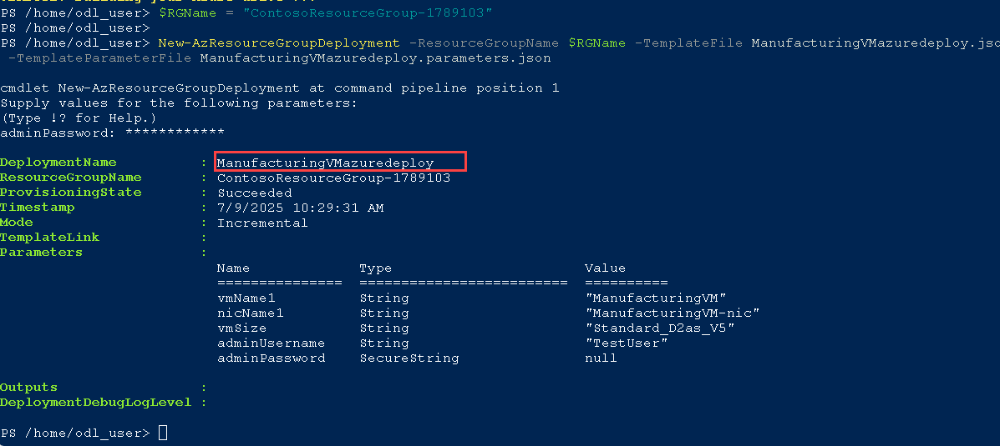  
   
1. When the deployment is complete, go to the **Azure portal** home page, and then select **Virtual Machines**.

1. Verify that the virtual machine has been created.

   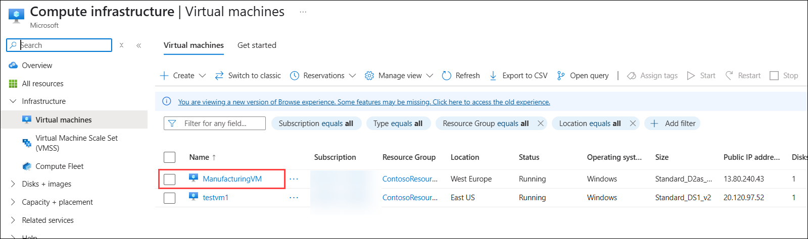

   > **Congratulations** on completing the task! Now, it's time to validate it. Here are the steps:
   > - Hit the Validate button for the corresponding task. If you receive a success message, you can proceed to the next task. 
   > - If not, carefully read the error message and retry the step, following the instructions in the lab guide.
   > - If you need any assistance, please contact us at cloudlabs-support@spektrasystems.com. We are available 24/7 to help.

   <validation step="53f858e3-8ea3-46e1-9e46-27d87801bd28" />

## Task 2: Connect to the Test VMs using RDP

In this task, your connecting to the Test VM using RDP.

1. On the Azure Portal home page, select **Virtual Machines**.

1. Select **ManufacturingVM**.

   

1. On ManufacturingVM, select **Connect (1)** from the drop-down click on **Connect (2)**.

   

1. On ManufacturingVM | Connect, select **Download RDP file**.

   

1. If any warning pops-up in "edge downloads" select **Keep**.

1. Click on **Open file**.

   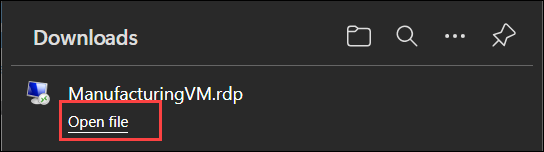

1. Select **Connect**.

   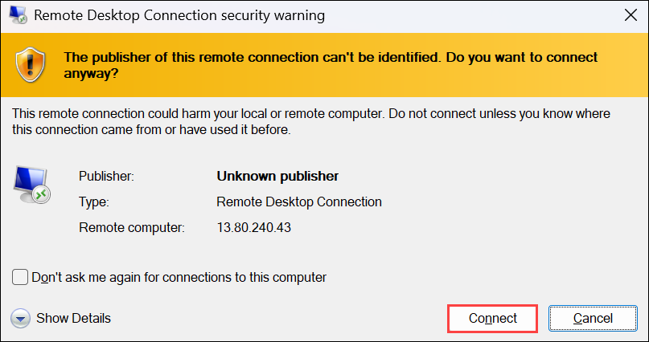

1. Click on **More choices**.

1. Select **Use a different account**.

1. Connect to ManufacturingVM using the RDP file, and the username `.\TestUser` **(1)** and the password `Pa$$w0rd1234` **(2)** you provided during deployment and then **OK (3)**.

   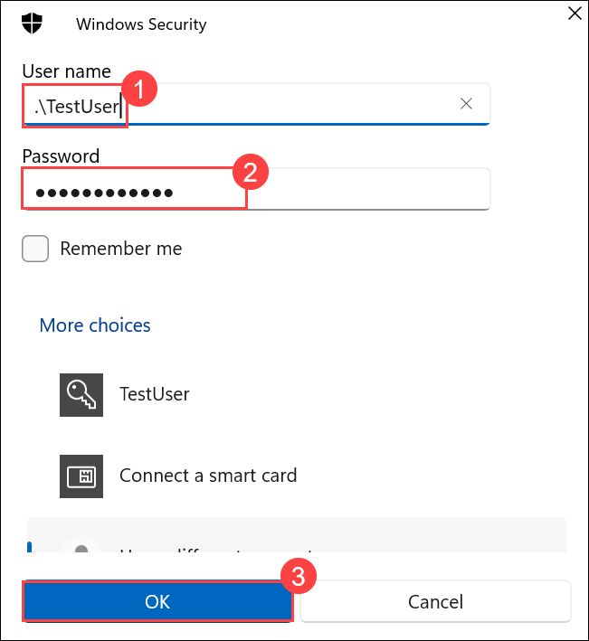

1. Click on **Yes** to access the VM. 

1. Navigate back to the LabVM Azure Portal home page, select **Virtual Machines**.

1. Select **testvm1**.

   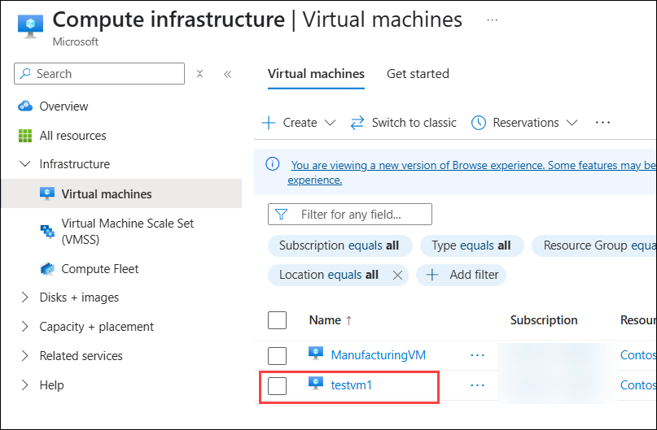

1. On testvm1, select **Connect (1)** then from the drop-down click **Connect (2)**.

   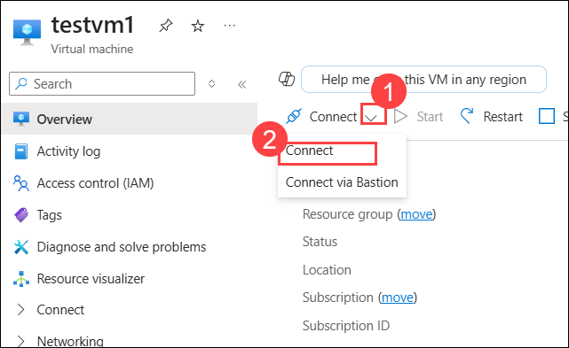

1. On **testvm1 | Connect** page, under **Native RDP**, select **Download RDP file**. 

   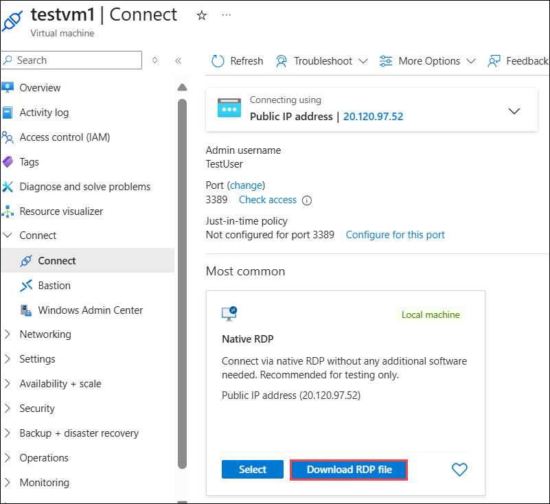

1. If any warning pops-up in "edge downloads" select **Keep**.

1. Click on **Open file**.

   

1. Select **Connect**.

   

1. Click on **More choices**.

1. Select **Use a different account**.

1. Connect to testvm1 using the RDP file, and the username **.\TestUser** and the password **Pa$$w0rd1234**.

1. Click on **Yes** to access the VM.

1. On both VMs, in **Choose privacy settings for your device**, select **Accept**.

1. On both VMs, in **Networks**, select **Yes**.

1. On **testvm1**, Right click on **start (1)** and select **windows PowerShell (Admin) (2)**.

   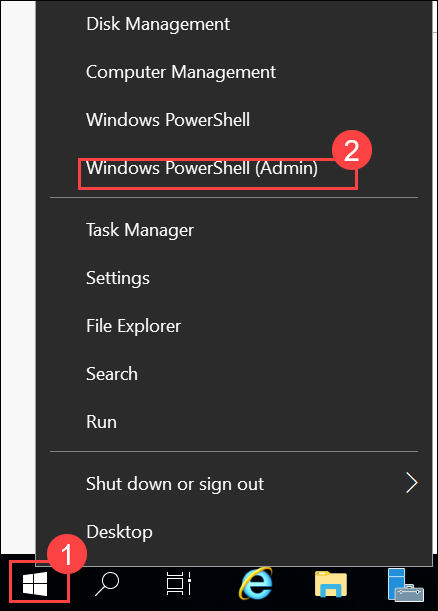

1. Run the following command: **ipconfig**

1. Note the IPv4 address. 

   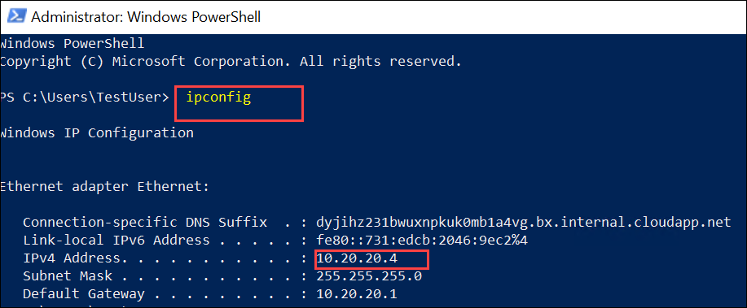

## Task 3: Test the connection between the VMs

In this task, you'll be testing the connection between the ManufacturingVM (in the ManufacturingVnet) and testvm1 (in the CoreServicesVnet). The goal is to verify that there's no connection to testvm1 using the Test-NetConnection cmdlet. 

1. On the **ManufacturingVM**, Right click on **start (1)** and select **windows PowerShell (Admin) (2)**.

   

1. Use the following command to verify that there is no connection to testvm1 on CoreServicesVnet. Be sure to use the IPv4 address for testvm1.

   ```powershell
    Test-NetConnection 10.20.20.4 -port 3389
    ```

1. The test connection should fail, and you will see a result similar to the following:

   

## Task 4: Create VNet peerings between CoreServicesVnet and ManufacturingVnet

In this task, you'll be creating VNet peering between CoreServicesVnet and ManufacturingVnet.

1. Navigate back to the LabVM's Azure home page, search for **Virtual Networks (1)** and then select **Virtual Networks (2)**.

   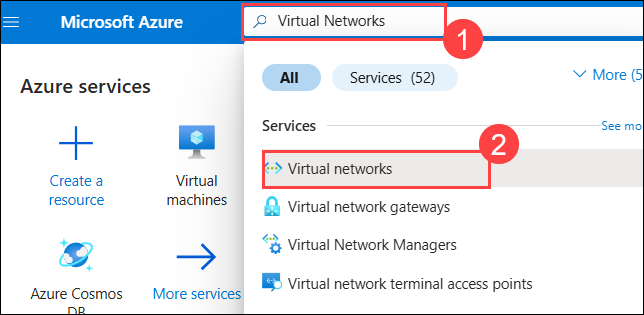

1. Then select **CoreServicesVnet**.

   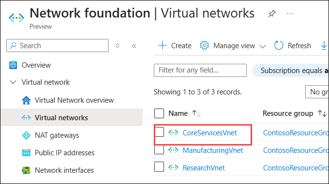

1. In CoreServicesVnet, under **Settings**, select **Peerings**.

   

1. On CoreServicesVnet | Peerings, select **+ Add**.

1. Use the information in the following table to create the peering.

   | **Section**                          | **Option**                                    | **Value**                             |
   | ------------------------------------ | --------------------------------------------- | ------------------------------------- |
   | Remote virtual network summary       |                                               |                                       |
   |                                      | Peering link name                             | **ManufacturingVnet-to-CoreServicesVnet (1)** |
   |                                      | Virtual network deployment model              | **Resource manager (2)**                      |
   |                                      | I know my resource ID                         | Not selected                          |
   |                                      | Subscription                                  | **Select the Subscription provided (3)**      |
   |                                      | Virtual network                               | Select **ManufacturingVnet (4)**                     |
   | Remote virtual network peering settings         |                                               |                                       |
      |                                      | Allow 'ManufacturingVnet' to access 'CoreServicesVnet'                             | **Enabled (5)** |   
      |                                      | Allow ''ManufacturingVnet' to receive forwarded traffic from 'CoreServicesVnet'                             | **Enabled (6)** |      
   | Local virtual network summary        |                                               |                                       |
   |                                      | Peering link name                             | **CoreServicesVnet-to-ManufacturingVnet (7)** |
   | Local virtual network peering settings        |                                               |                                       |
   |                                      | Allow 'CoreServicesVnet' to access 'ManufacturingVnet'                             | **Enabled (8)** |   
   |                                      | Allow 'CoreServicesVnet' to receive forwarded traffic from 'ManufacturingVnet'                             | **Enabled (9)** |     
        
1. Review your settings and select **Add (10)**. 

   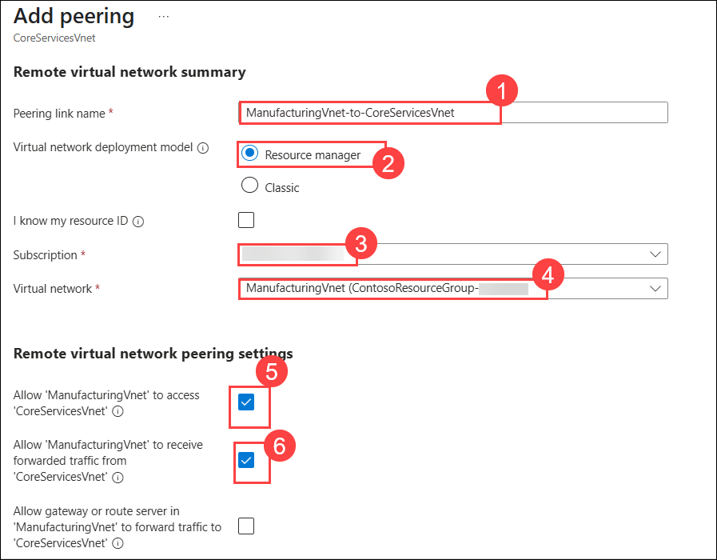
   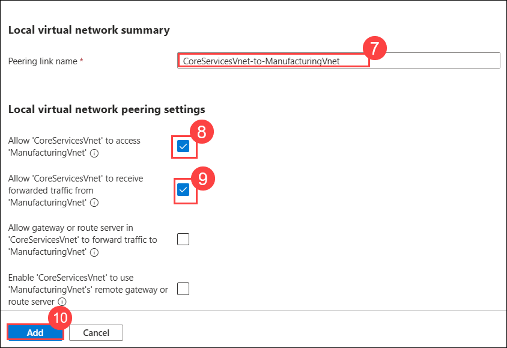

1. In CoreServicesVnet | Peerings, verify that the **CoreServicesVnet-to-ManufacturingVnet** peering is listed.

1. Navigate back to the **Virtual networks** page.

1. In **ManufacturingVnet**, under **Settings**, select **Peerings (1)**.

1. Verify the **ManufacturingVnet-to-CoreServicesVnet (2)** peering is listed.

   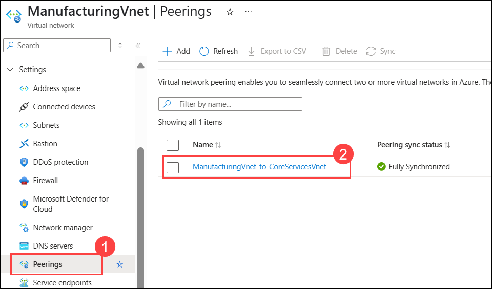

   > **Congratulations** on completing the task! Now, it's time to validate it. Here are the steps:
   > - Hit the Validate button for the corresponding task. If you receive a success message, you can proceed to the next task. 
   > - If not, carefully read the error message and retry the step, following the instructions in the lab guide.
   > - If you need any assistance, please contact us at cloudlabs-support@spektrasystems.com. We are available 24/7 to help.

   <validation step="430adf7c-4c27-47f2-b079-292ae528c898" />

## Task 5: Test the connection between the VMs

In this task, you'll be testing the connectivity between the ManufacturingVM and TestVM1 after setting up the VNet peering between CoreServicesVnet and ManufacturingVnet. 

1. On the **ManufacturingVM,** open a PowerShell prompt.

1. Use the following command to verify that there is now a connection to TestVM1 on CoreServicesVnet. 

   ```powershell
    Test-NetConnection 10.20.20.4 -port 3389
    ```

1. The test connection should succeed, and you will see a result similar to the following:

   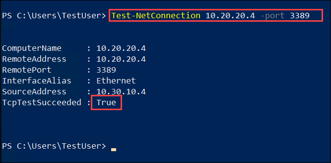

## Task 6: Clean up resources

In this task, you'll be cleaning up the Azure resources you've created during this module to avoid unnecessary charges.
  
   >**Note**: Remember to remove any newly created Azure resources that you no longer use. Removing unused resources ensures you will not see unexpected charges.

1. On the Azure portal, open the **PowerShell** session within the **Cloud Shell** pane. (Create Cloud Shell storage if needed, using default settings.)

1. Delete all resource groups you created throughout the labs of this module by running the following command:

   ```powershell
   Remove-AzResourceGroup -Name 'ContosoResourceGroup-<inject key="DeploymentID" enableCopy="false"/>' -Force -AsJob
   ```

    >**Note**: The command executes asynchronously (as determined by the -AsJob parameter), so while you will be able to run another PowerShell command immediately afterwards within the same PowerShell session, it will take a few minutes before the resource groups are actually removed.


## Key takeaways

Congratulations on completing the lab. Here are the main takeaways for this lab. 

+ Virtual network peering enables you to seamlessly connect two Azure virtual networks. The virtual networks appear as one for connectivity purposes.
+ Azure supports connecting virtual networks within the same Azure region and across Azure regions (global).
+ The traffic between virtual machines in peered virtual networks is routed directly through the Microsoft backbone infrastructure, not through a gateway or over the public Internet.
+ You can resize the address space of Azure virtual networks that are peered without incurring any downtime on the currently peered address space.

## Review

In this lab, you have completed:

+ Creating a Virtual Machine to test the configuration
+ Connecting to the Test VMs using RDP
+ Testing the connection between the VMs
+ Creating VNet peerings between CoreServicesVnet and ManufacturingVnet
+ Testing the connection between the VMs

## You have successfully completed the lab.

