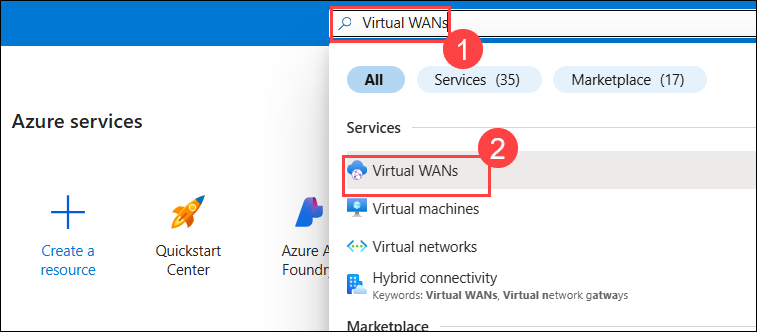
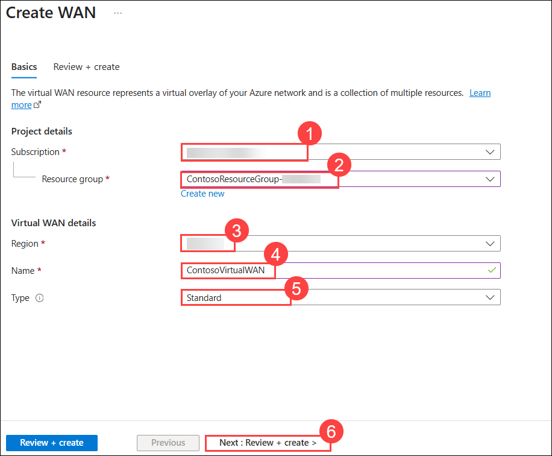
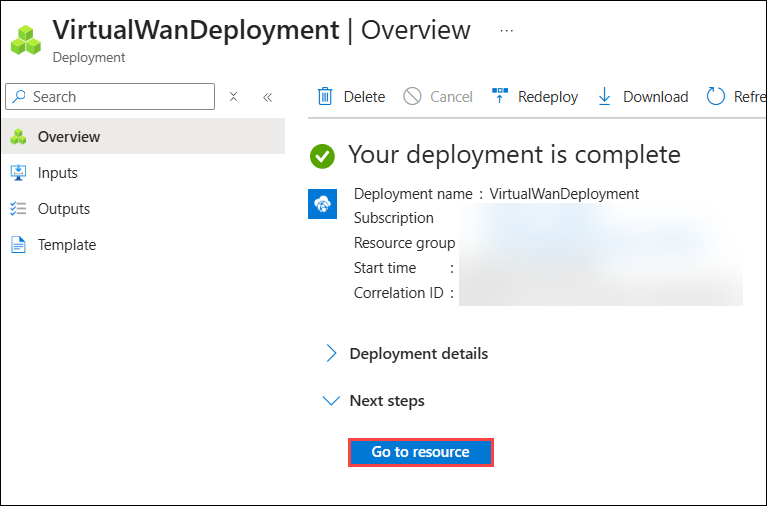
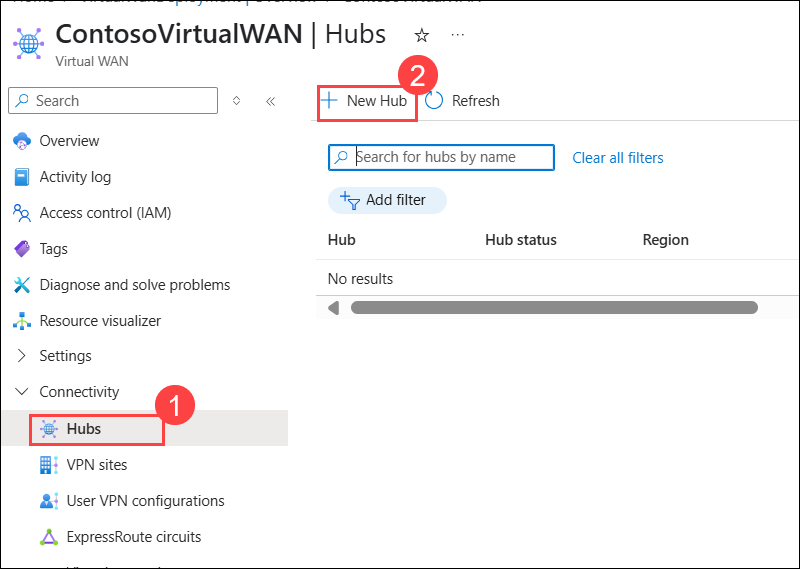
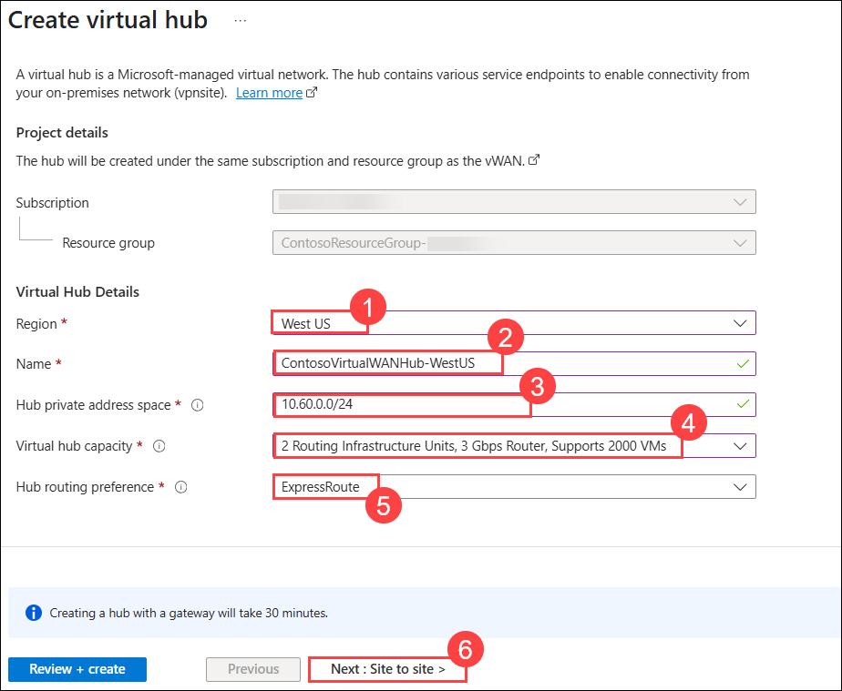
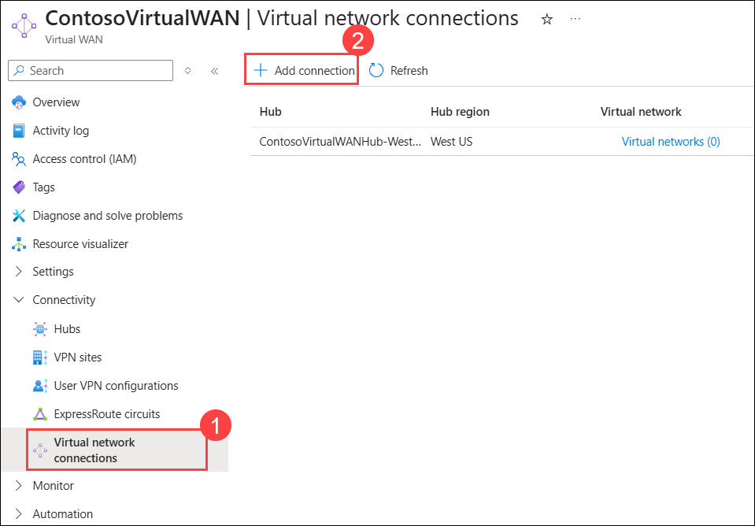
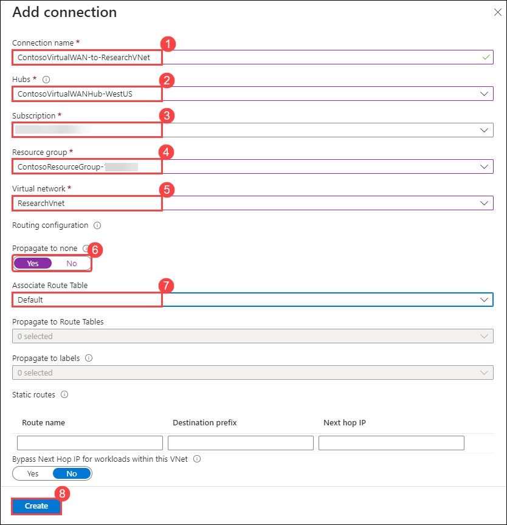

# Module 02-Unit 7 Create a Virtual WAN by using Azure Portal

## Lab Overview

In this lab, you will set up a Virtual WAN in Azure, create a hub using the Azure Portal, and connect a VNet to the Virtual Hub. Azure Virtual WAN simplifies large-scale branch connectivity and offers centralized network management. You will configure the Virtual WAN resource, create a hub as a central connection point, and connect a VNet to the hub, ensuring seamless communication and optimized routing. This lab will provide you with the skills to efficiently manage complex network environments using Azure Virtual WAN.

## Lab Objectives

In this lab, you will complete the following tasks:

+ Task 1 : Create a Virtual WAN.
+ Task 2:  Create a Hub by Using Azure Portal.
+ Task 3: Connect a VNet to the Virtual Hub.

## Estimated Duration: 65 minutes

## Architecture diagram

   ‎

### Task 1: Create a Virtual WAN

In this task you will create a Virtual WAN (Wide Area Network) in Azure, which is used to manage and connect multiple virtual networks across different regions. Virtual WANs offer a centralized management approach for connectivity and routing, allowing you to easily set up VPNs, ExpressRoute connections, 

1. On Azure Portal page, in **Search resources, services and docs (G+/)**, enter **Virtual WANs (1)**, and then select **Virtual WANs (2)** under services.

   

1. On the Virtual WAN page, select + **Create**. 

1. On the Create WAN page, on the **Basics** tab, fill in the following fields:

   - **Subscription:** Use the existing subscription **(1)**

   - **Resource group:** **ContosoResourceGroup-<inject key="DeploymentID" enableCopy="false"/> (2)**

   - **Region:** Select **<inject key="Region" enableCopy="false"/> (3)**

   - **Name:** **ContosoVirtualWAN (4)**

   - **Type:** **Standard (5)**

   - When you have finished filling out the fields, select **Review + create (6)**.

     

1. Once validation passes, select **Create** to create the Virtual WAN. Wait for the deployment to get completed.

1. Click on **Go to resource**.

   

   > **Congratulations** on completing the task! Now, it's time to validate it. Here are the steps:
   > - Hit the Validate button for the corresponding task. If you receive a success message, you can proceed to the next task. 
   > - If not, carefully read the error message and retry the step, following the instructions in the lab guide.
   > - If you need any assistance, please contact us at cloudlabs-support@spektrasystems.com. We are available 24/7 to help.

   <validation step="c7427a0d-37bd-4ddd-9888-2b7c903f071a" />

### Task 2: Create a hub by using Azure Portal

In this task, you will create a hub by using Azure Portal, you'll create a Virtual Hub within your Virtual WAN.

A hub contains gateways for site-to-site, ExpressRoute, or point-to-site functionality. It takes 30 minutes to create the site-to-site VPN gateway in the virtual hub. You must create a Virtual WAN before you can create a hub.

1. On the Virtual WAN page, from the left navigation menu, under **Connectivity**, select **Hubs (1)**.

   - On the Hubs page, select **+ New Hub (2)** to open the Create virtual hub page.

        
  
1. On the Create virtual hub page **Basics** tab, complete the following fields:

   - Region: **West US (1)**
   
   - Name: **ContosoVirtualWANHub-WestUS (2)**
   
   - Hub private address space: **10.60.0.0/24 (3)**
   - Virtual hub capacity: **2 Routing 
   Infrastructure Units (4)**
   
   - Hub routing preference: **ExpressRoute (5)**

   - Select **Next: Site-to-site (6)**   

     

1. On the **Site-to-site** tab, complete the following fields:
   - **Do you want to create a Site to site (VPN gateway)?:** `Yes (1)`
   
   - The **AS Number** `field cannot be edited (2)`
   
   - **Gateway scale units:** `1 scale unit - 500 Mbps x 2 (3)`
   
   - **Routing preference:** leave the default 
   
   - **Review + create** to validate **(4)**

      .png)

1. Select **Create** to create the hub. 

1. After `30 minutes`, **Refresh** to view the hub on the Hubs page. Wait for the deployment to finish before proceeding to the next task.

   > **Congratulations** on completing the task! Now, it's time to validate it. Here are the steps:
   > - Hit the Validate button for the corresponding task. If you receive a success message, you can proceed to the next task. 
   > - If not, carefully read the error message and retry the step, following the instructions in the lab guide.
   > - If you need any assistance, please contact us at cloudlabs-support@spektrasystems.com. We are available 24/7 to help.

   <validation step="57e2db2a-f095-49a3-9a12-0f902763015b" />

### Task 3: Connect a VNet to the Virtual Hub

In this task, you will connect a VNet to the Virtual Hub, you will connect a Virtual Network (VNet) to the Virtual Hub within your Virtual WAN. 

1. Navigate back to the **ContosoVirtualWAN**  Virtual WAN that you created. 

1. From the left navigation menu under **Connectivity**, select **Virtual network connections (1)** and then select **+ Add connection (2)**.

   

1. In Add connection, use the following information to create the connection.

   - Connection name : **ContosoVirtualWAN-to-ResearchVNet (1)**

   - Hubs: **ContosoVirtualWANHub-WestUS (2)**

   - Subscription : **Leave it as default (3)**

   - Resource Group : **ContosoResourceGroup-<inject key="DeploymentID" enableCopy="false"/> (4)**

   - Virtual network: **ResearchVNet (5)**

   - Propagate to none: **Yes (6)**

   - Associate Route Table: **Default (7)**

   - Select **Create (8)**.

     

## Key takeaways

Congratulations on completing the lab. Here are the main takeaways for this lab. 

+ Azure Virtual WAN is a networking service that brings many networking, security, and routing functionalities together to provide a single operational interface
+ The Virtual WAN architecture is a hub and spoke architecture with scale and performance built in for branches, users, ExpressRoute circuits, and virtual networks.
+ There are three main usage cases for virtual WAN: Site to site, Point to site, and ExpressRoute. 
+ There are two types of virtual WANs: Basic (Site-to-site VPN only) and Standard.

## Review

In this lab, you have completed:

+ Creating a Virtual WAN
+ Creating a hub by using Azure Portal
+ Connecting a VNet to the Virtual Hub

## You have successfully completed the lab.
