# Lab 4b: Create a Traffic Manager profile using the Azure portal

## Lab Overview

In this lab, you will create a Traffic Manager profile to deliver high availability for the fictional Contoso Ltd organization's web application.
You will create two instances of a web application deployed in two different regions (**<inject key="Region" enableCopy="false"/>** and West Europe). The **<inject key="Region" enableCopy="false"/>** region will act as a primary endpoint for Traffic Manager, and the West Europe region will act as a failover endpoint.

You will then create a Traffic Manager profile based on endpoint priority. This profile will direct user traffic to the primary site running the web application. Traffic Manager will continuously monitor the web application, and if the primary site in **<inject key="Region" enableCopy="false"/>** is unavailable, it will provide automatic failover to the backup site in West Europe.

## Lab Objectives
In this lab, you will complete the following tasks:

+ Task 1: Create the web apps
+ Task 2: Create a Traffic Manager profile
+ Task 3: Add Traffic Manager endpoints
+ Task 4: Test the Traffic Manager profile

## Estimated time: 35 minutes

## Architecture diagram

## Task 1: Create the web apps

In this task, you will create two instances of a web application deployed in the two different Azure regions.

1. On any Azure Portal page, in **Search resources, services and docs (G+/)** box at the top of the portal, enter **WebApp (1)**, and then select **App Services (2)** under services.

   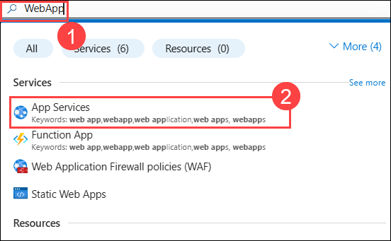

1. Select **+ Create (1)**  and then select **+ Web App (2)** to create a Web App.

     

1. On the **Create Web App** page, on the **Basics** tab, use the information in the table below to create the first web application.

   | **Setting**      | **Value**                                                    |
   | ---------------- | ------------------------------------------------------------ |
   | Subscription     | Select your subscription **(1)**                                    |
   | Resource group   | Select **Contoso-RG-TM1-<inject key="DeploymentID" enableCopy="false"/> (2)**             |
   | Name             | **ContosoWebAppEastUS<inject key="DeploymentID" enableCopy="false"/> (3)**  |
   | Secure unique default hostname on | **Ture off the toggle (4)**                   |
   | Publish          | **Code (5)**                                                     |
   | Runtime stack    | **ASP.NET V4.8 (6)**                                             |
   | Operating system | **Windows (7)**                                                  |
   | Region           | **<inject key="Region" enableCopy="false"/> (8)**                                                  |
   | Windows Plan     | Select **Create  new**  Name: **ContosoAppServicePlanEastUS (9)** |
   | Pricing Plan     | **Standard S1 100 total ACU, 1.75-GB  memory (10)**               |

   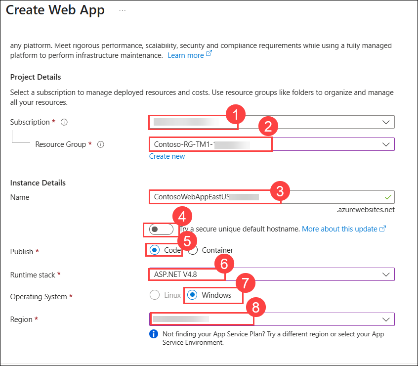
   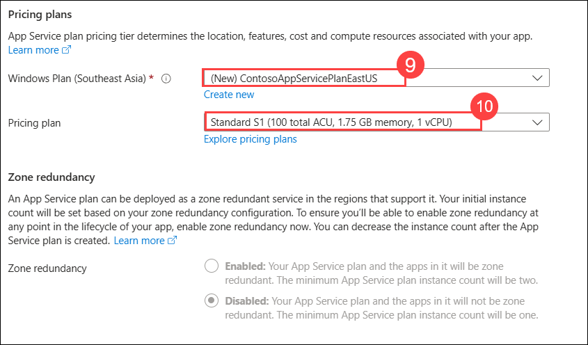
   
1. Select **Monitor + secure** tab from the top.

   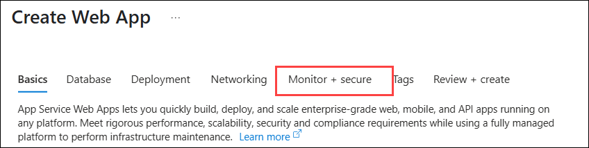

1. On the **Monitor + secure** tab, select the **No (1)** option for **Enable Application Insights** and select **Review + create (2)**.

   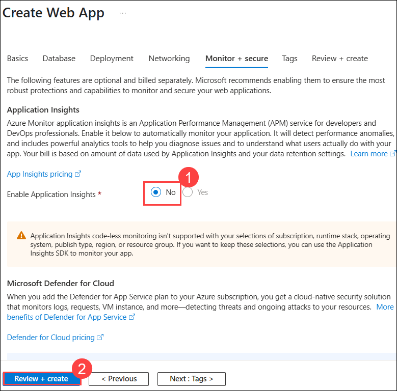

1. Select **Create**. When the Web App successfully deploys, it creates a default web site.

    >**Note**: We are currently encountering an issue while deploying the web app in East US. If you face the same issue, kindly change the region to another, then deploy the web app and proceed with the next step.
    
    >**Note**: **If you encounter a quota issue while deploying a Standard SKU-based Web App, try switching to a different region.**
    
1. Repeat steps `1-6` above to create a second web app. Use the same settings as before except for the information in the table below. 

   | **Setting**    | **Value**                                                    |
   | -------------- | ------------------------------------------------------------ |
   | Resource group | Select **Contoso-RG-TM2-<inject key="DeploymentID" enableCopy="false"/> (1)**             |
   | Name           | **ContosoWebAppWestEurope<inject key="DeploymentID" enableCopy="false"/> (2)**   |
   | Region         | **West Europe (3)**                                              |
   | Windows Plan   | Select **Create  new**  Name: **ContosoAppServicePlanWestEurope (4)** |

   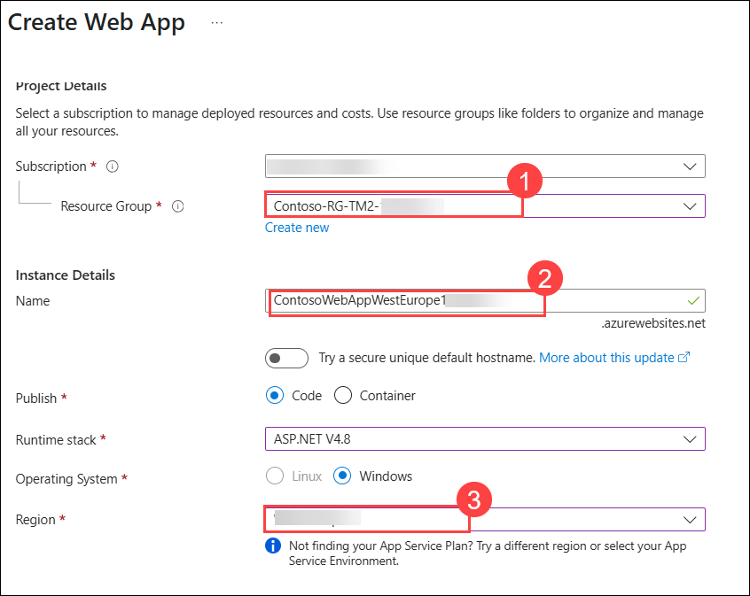
   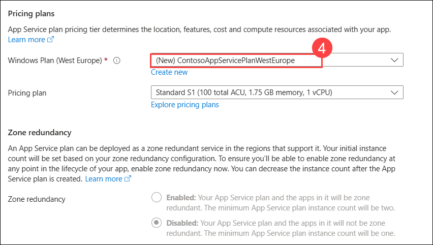         

1. On Azure Portal page, in **Search resources, services and docs (G+/)** box at the top of the portal, enter **App Services (1)**, and then select **App Services (2)** under services.

   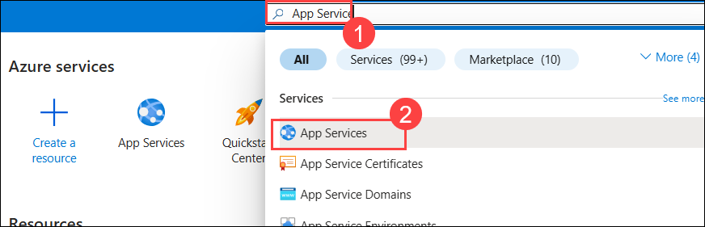

1. You should see the two new web apps listed.

   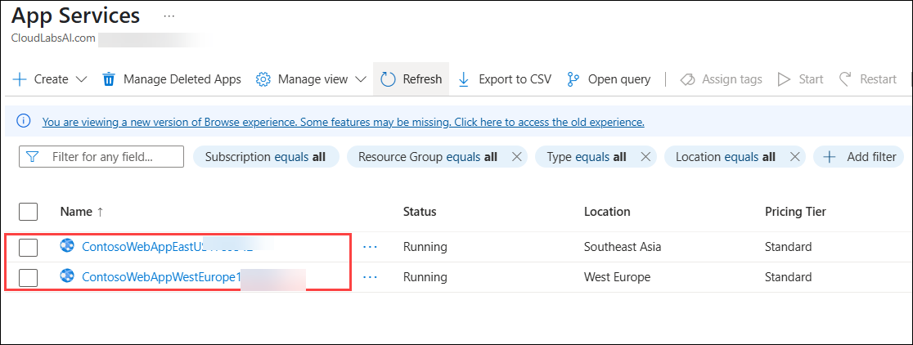

   > **Congratulations** on completing the task! Now, it's time to validate it. Here are the steps:
   > - Hit the Validate button for the corresponding task. If you receive a success message, you can proceed to the next task. 
   > - If not, carefully read the error message and retry the step, following the instructions in the lab guide.
   > - If you need any assistance, please contact us at cloudlabs-support@spektrasystems.com. We are available 24/7 to help.

   <validation step="4d5ecc40-776d-459c-867f-50db4b49ce0c" />

## Task 2: Create a Traffic Manager profile

In this task you will create a Traffic Manager profile that directs user traffic based on endpoint priority.

1. On Azure Portal page, in **Search resources, services and docs (G+/)** box at the top of the portal, enter **Traffic Manager profiles (1)**, and then select **Traffic Manager profiles (2)** under services.

   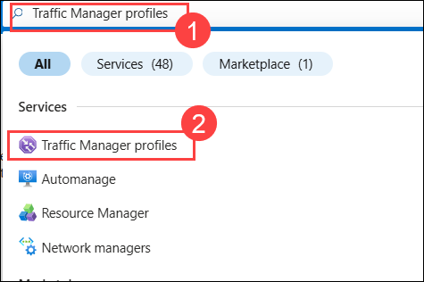

1. On **Load balancing | Traffic Manager** page, select **+ Create**.

1. On the **Create Traffic Manager profile** page, use the information in the table below to create the Traffic Manager profile and then click **Review+Create (5)**

   | **Setting**             | **Value**                |
   | ----------------------- | ------------------------ |
   | Subscription                    | Leave the default one **(1)** |   
   | Resource group          | **Contoso-RG-TM1-<inject key="DeploymentID" enableCopy="false"/> (2)**   |   
   | Name                    | **Contoso-TMProfile<inject key="DeploymentID" enableCopy="false"/> (3)** |
   | Routing method          | **Priority (4)**             |

   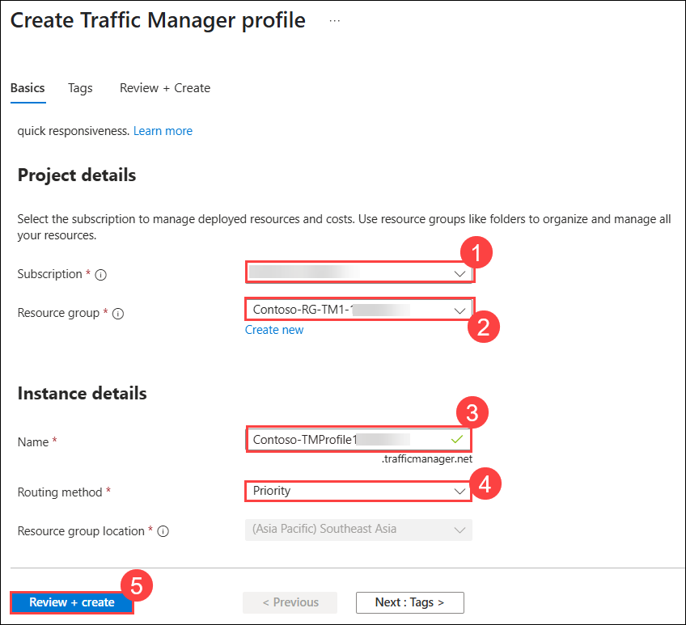   

1. Select **Create**. Wait for the deployment to complete.

   > **Congratulations** on completing the task! Now, it's time to validate it. Here are the steps:
   > - Hit the Validate button for the corresponding task. If you receive a success message, you can proceed to the next task. 
   > - If not, carefully read the error message and retry the step, following the instructions in the lab guide.
   > - If you need any assistance, please contact us at cloudlabs-support@spektrasystems.com. We are available 24/7 to help.

   <validation step="333aadc8-666f-456e-888e-52ca345debb7" />

## Task 3: Add Traffic Manager endpoints

In this task, you will add the website in the **<inject key="Region" enableCopy="false"/>** as the primary endpoint to route all the user traffic. You will then add the website in West Europe as a failover endpoint. If the primary endpoint becomes unavailable, then traffic will automatically be routed to the failover endpoint.

1. On Azure Portal page, in **Search resources, services and docs (G+/)** box at the top of the portal, enter **Traffic Manager profiles (1)**, and then select **Traffic Manager profiles (2)** under services.

    

1. Kindly refresh the page to find and select **Contoso-TMProfile<inject key="DeploymentID" enableCopy="false"/>**.

   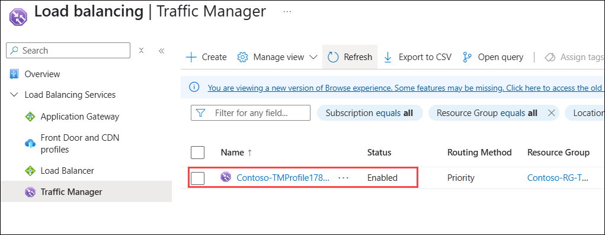

1. Under **Settings**, select **Endpoints (1)**, and then select **+ Add (2)**.

   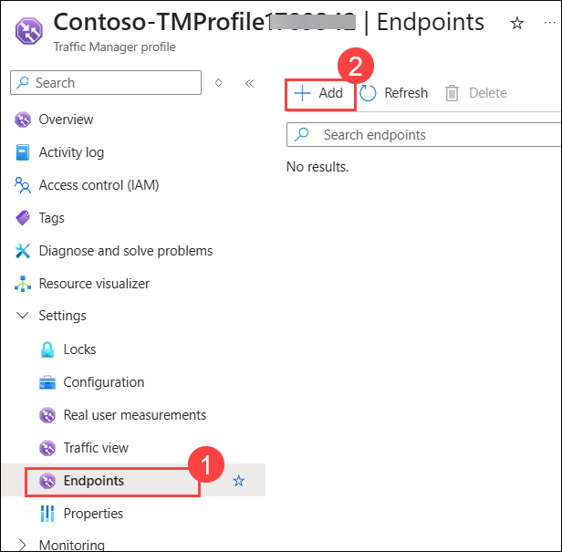

1. On the **Add endpoint** page, enter the information from the table below and then **Add (6)**

   | **Setting**          | **Value**                         |
   | -------------------- | --------------------------------- |
   | Type                 | **Azure endpoint (1)**                |
   | Name                 | **myPrimaryEndpoint (2)**             |
   | Target resource type | **App Service (3)**                   |
   | Target resource      | **ContosoWebAppEastUS<inject key="DeploymentID" enableCopy="false"/> (**<inject key="Region" enableCopy="false"/>**) (4)** |
   | Priority             | **1 (5)**                             |

   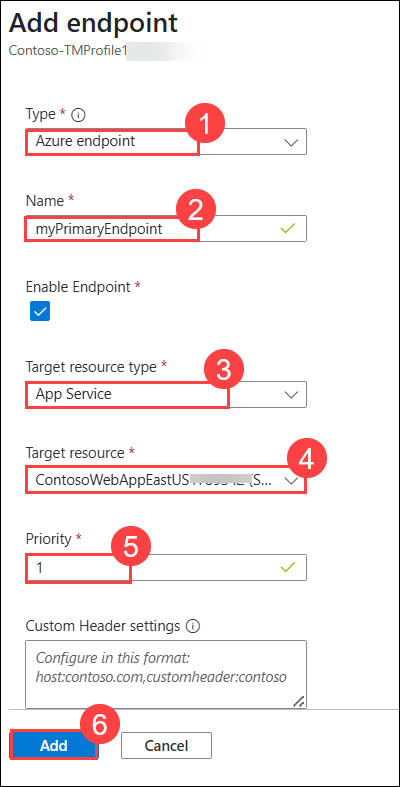

1. Select **+Add**, to create the **failover endpoint**.

1. Use the same settings as before except for the information in the table below and then **Add (6)**.

   | **Setting**     | **Value**                                 |
   | --------------- | ----------------------------------------- |
   | Type                 | **Azure endpoint (1)**                |   
   | Name            | **myFailoverEndpoint (2)**                    |
   | Target resource type | **App Service (3)**                   |
   | Target resource | **ContosoWebAppWestEurope<inject key="DeploymentID" enableCopy="false"/> (West Europe) (4)** |
   | Priority        | **2 (5)**                                     |

   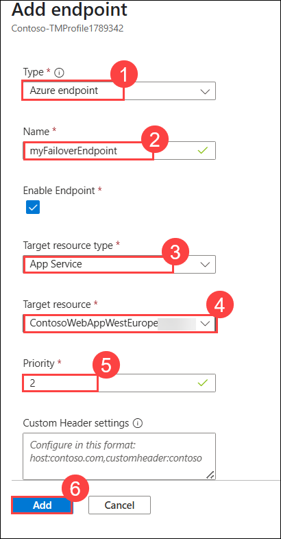      
      
    >**Note:** Setting a priority of 2 means that traffic will route to this failover endpoint if the configured primary endpoint becomes unhealthy.

1. Under **Settings**, select **Configuration (1)**, and then update the **Endpoint monitor settings** protocol to **HTTPS (2)** and **Port** to **443 (3)** and select **Save (4)**.

   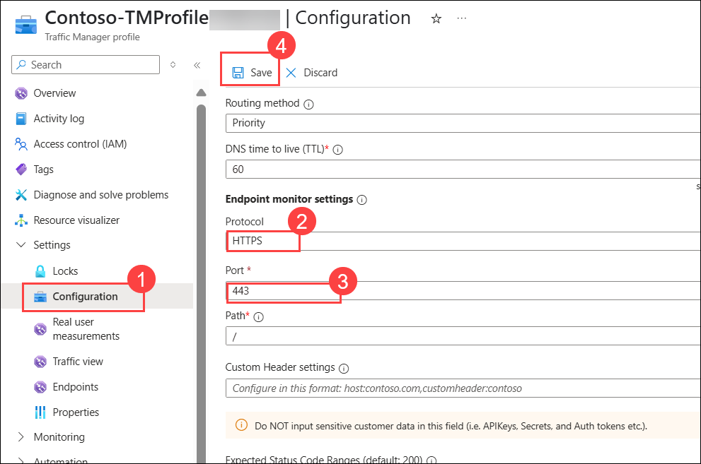    

1. The two new endpoints are displayed in the Traffic Manager profile. Notice that after a few minutes the **Monitoring status (1)** should change to **Online (2)**.

      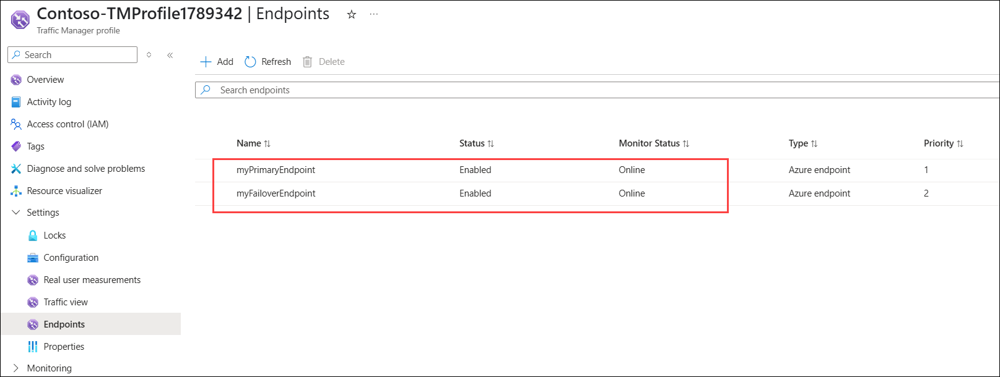

   > **Congratulations** on completing the task! Now, it's time to validate it. Here are the steps:
   > - Hit the Validate button for the corresponding task. If you receive a success message, you can proceed to the next task. 
   > - If not, carefully read the error message and retry the step, following the instructions in the lab guide.
   > - If you need any assistance, please contact us at cloudlabs-support@spektrasystems.com. We are available 24/7 to help.

   <validation step="ecc8a93e-6f61-41d8-99ab-214a855c04d6" />

## Task 4: Test the Traffic Manager profile

In this task, you will check the DNS name of your Traffic Manager profile, and then you will configure the primary endpoint so that it is unavailable. You will then verify that the web app is still available, to test that the Traffic Manager profile is successfully sending traffic to the failover endpoint.

1. On the **Contoso-TMProfile<inject key="DeploymentID" enableCopy="false"/>** page, select **Overview**.

1. On the **Overview** screen, copy the **DNS name** entry to the clipboard (or take note of it somewhere).

   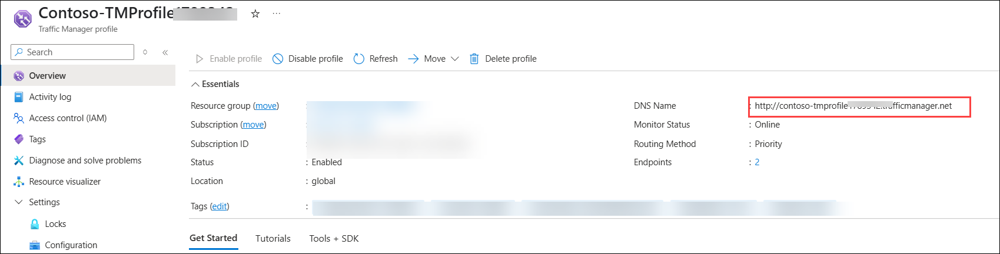 

1. Open a web browser tab, and paste (or enter) the **DNS name** entry (contoso-tmprofile.trafficmanager.net) into the address bar, and press Enter.

1. If you encounter **your coneection isn't private**. click on **advanced (1)** and then click on link provide **(2)**.

   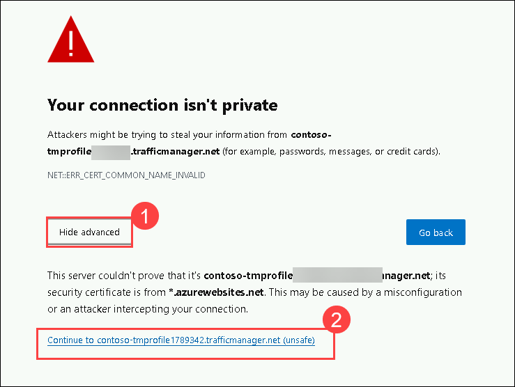

1. The web app's default web site should be displayed.

   

    >**Note**: If you get **404 Web Site not found** message, **Disable profile** from **Contoso-TMProfile<inject key="DeploymentID" enableCopy="false"/>** Traffic Manager profile overview page.

     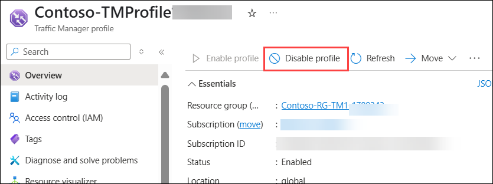    
    
     - Then select **Enable profile**. Then refresh the webpage.
   
1. Currently all traffic is being sent to the primary endpoint as you set its **Priority** to **1**.

1. To test the failover endpoint is working properly, you need to disable the primary site.

1. On the **Contoso-TMProfile<inject key="DeploymentID" enableCopy="false"/>** page, click on **Endpoint (1)** and then select **myPrimaryEndpoint** edit icon **(2)**.

   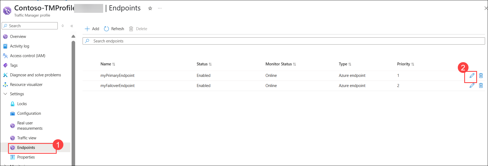

1. On the **myPrimaryEndpoint** page, under **Enable Endpoint**, select **Disable (1)** the checbox, and then select **Save (2)**.

   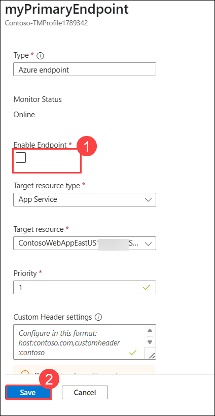

1. Close the **myPrimaryEndpoint** page (select the **X** in the top right corner of the page).

1. On the **Contoso-TMProfile<inject key="DeploymentID" enableCopy="false"/>** page, the **Monitor status** for **myPrimaryEndpoint** should now be **Disabled**.

   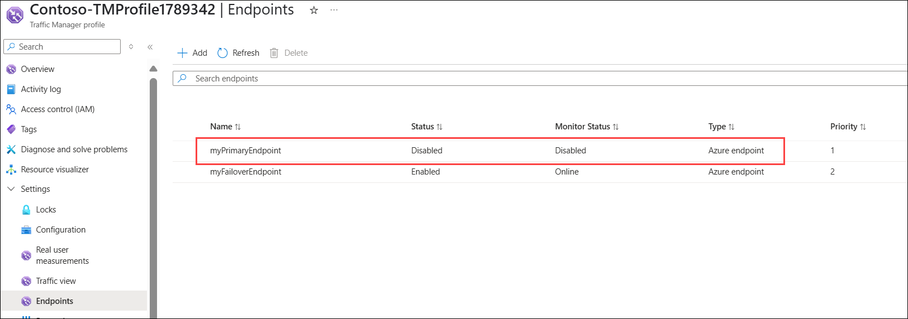

1. Open a new web browser session, and paste (or enter) the **DNS name** entry (contoso-tmprofile.trafficmanager.net) into the address bar, and press Enter.

1. Verify that the web app is still responding. As the primary endpoint was not available, the traffic was instead routed to the failover endpoint to allow the web site to still function.

1. The command executes asynchronously (as determined by the -AsJob parameter), so while you will be able to run another PowerShell command immediately afterwards within the same PowerShell session, it 
   will take a few minutes before the resource groups are actually removed.

   > **Congratulations** on completing the task! Now, it's time to validate it. Here are the steps:
   > - Hit the Validate button for the corresponding task. If you receive a success message, you can proceed to the next task. 
   > - If not, carefully read the error message and retry the step, following the instructions in the lab guide.
   > - If you need any assistance, please contact us at cloudlabs-support@spektrasystems.com. We are available 24/7 to help.

   <validation step="20dd3dc3-fd2c-4271-8cb3-6f7fb5223caf" />

## Key takeaways

Congratulations on completing the lab. Here are the main takeaways for this lab. 
+ Azure Traffic Manager is a DNS-based traffic load balancer. This service allows you to distribute traffic to your public facing applications across the global Azure regions.
+ Traffic Manager has six traffic-routing methods that allow you to control how Traffic Manager chooses which endpoint should receive traffic from each end user. How many can you name?
+ You can nest Traffic Manager profiles to combine the benefits of more than one traffic-routing method. Nested profiles allow you to override the default Traffic Manager behavior to support larger and more complex application deployments.

## Review
In this lab, you have completed:
+ Create the web apps
+ Create a Traffic Manager profile
+ Add Traffic Manager endpoints
+ Test the Traffic Manager profile
 
## You have successfully completed the lab.
